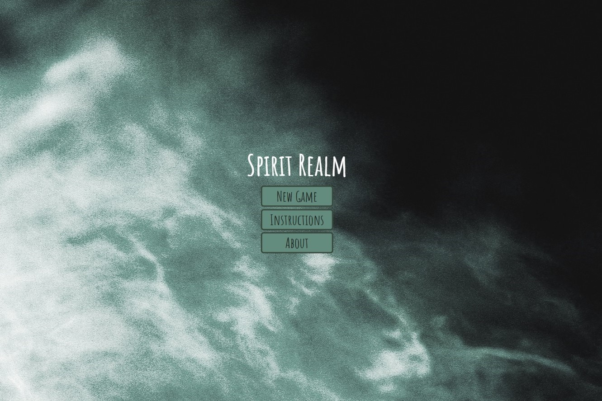
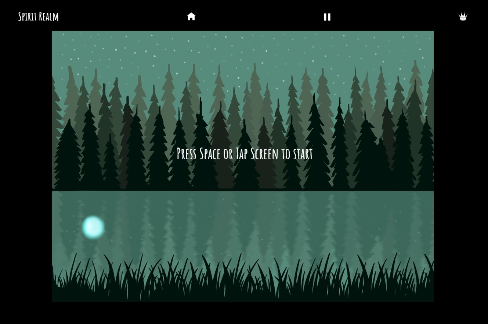
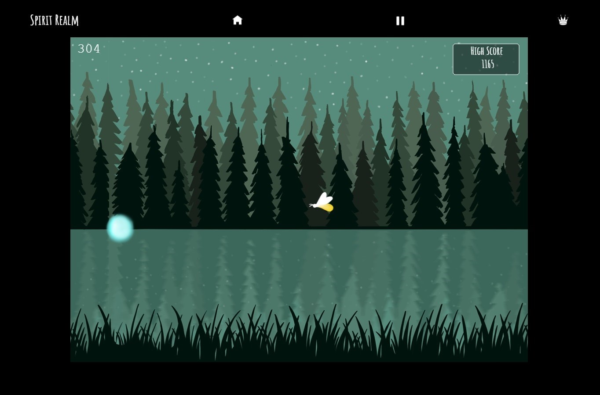
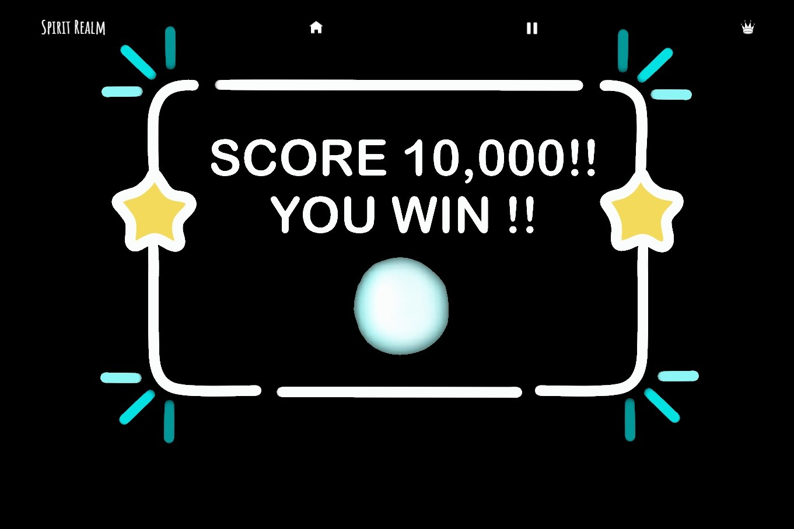

## View Here

https://emilyamartin.github.io/Side-Scroller-Game-/

## Project Overview

Spirit Realm is an endless side scroller game based on folklore legends. The first level of the game is based on a Will-O-Wisp spirit. The legend talks about how travelers encounter an atmospheric ghost light when traveling at night, especially near bogs, swamps or marshes. In the first level the player will help guide a Will-O-Wisp spirit through a bog while avoiding other bog creatures. Once the player reaches a score of 10,0000 they have successfully completed the first level!

## Motivation

My motivation for creating Spirit Realm comes from my love of playing endless side scroller games and my interest in folklore and ghost stories. In the future I hope to expand on the game and create more levels based on other spirits and folklore legends.

## Key Features

Single player - Try your best to get the highest score you can!
 
Desktop and Mobile- Use a keyboard or touch screen to play the game.
 
Restrictions - The game currently only works in profile mode on mobile.
 
Highest Score Count - View your highest score per run. This feature can be toggled on/off.
 
Sound Effect - This feature can be toggled on/off.

## Technology Stack

Layout - Figma
 
Artwork - ProCreate
 
Languages - HTML/CSS/JavaScript
 

## Resources

Artwork and game assets created by Emily Martin
 
Photo by Adam Kring on Unsplash
 
Fonts by Google Fonts

## Credits

My coach, Matthew Vey, has been an amazing support throughout the development of this project. I am deeply thankful for his guidance and encouragement. This project wouldn’t have been possible without his support!

## Preview

